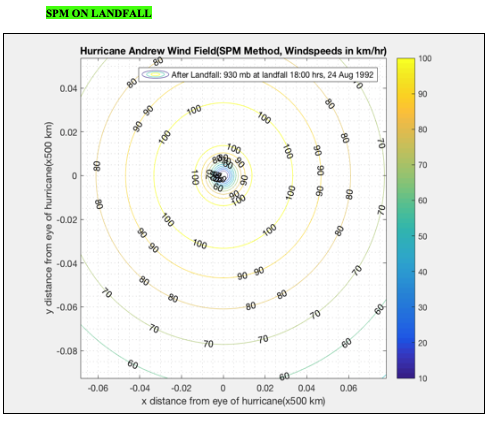

# MatLab-Creations
MATLAB coding projects related to ocean engineering.

For equations and graphs please refer to the Shore Protection Manual (SPM) or the Coastal Engineering Manual (CEM). Both can be obtained online. 

A few example results from the code:

Hurricane Forecasting Result Example:

Velocity\Acceleration\Pressure Profile Results:

